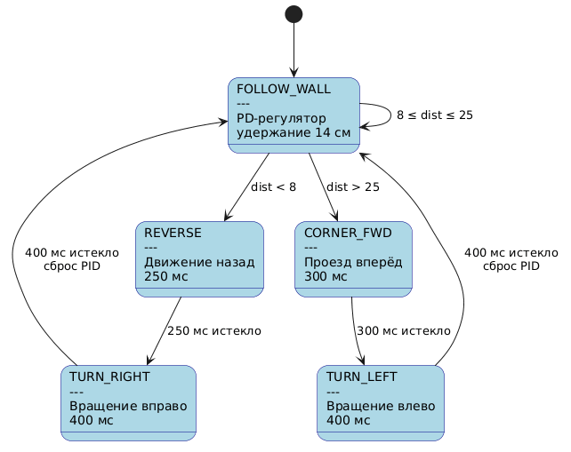

https://s3.1zq.ru/public/StateMachine.mp4 - демонстрация

# Машина состояний для следования по периметру лабиринта

## Оглавление

1. [Постановка задачи](#постановка-задачи)
2. [Аппаратная часть](#аппаратная-часть)
3. [Машина состояний](#машина-состояний)
4. [PID-регулятор](#pid-регулятор)
5. [Описание кода](#описание-кода)
6. [Параметры и калибровка](#параметры-и-калибровка)
7. [Выводы](#выводы)

---

## Постановка задачи

Реализовать автономного робота, обходящего периметр лабиринта по **правилу левой руки**. Лабиринт имеет коридоры шириной ≥ габарита робота, повороты только на 90°/270°, без изолированных стен. Робот не должен сталкиваться со стенами и пропускать коридоры.

---

## Аппаратная часть

| Компонент | Назначение | Пины |
|---|---|---|
| HC-SR04 (слева) | Измерение расстояния до стены | TRIG → A0, ECHO → A1 |
| Motor Shield (L298N) | Управление моторами | DIR: 7/4, PWM: 6/5 |
| 2 × DC-мотора | Дифференциальный привод | — |

---

## Машина состояний

### Диаграмма состояний



### Таблица переходов

| Текущее состояние | Условие | Следующее состояние | Действие |
|---|---|---|---|
| `FOLLOW_WALL` | `dist < 8` | `REVERSE` | Стоп, запуск таймера |
| `FOLLOW_WALL` | `dist > 25` | `CORNER_FWD` | Стоп, запуск таймера |
| `FOLLOW_WALL` | `8 ≤ dist ≤ 25` | `FOLLOW_WALL` | PD-коррекция скоростей |
| `REVERSE` | 250 мс истекло | `TURN_RIGHT` | Запуск таймера поворота |
| `TURN_RIGHT` | 400 мс истекло | `FOLLOW_WALL` | Сброс PID |
| `CORNER_FWD` | 300 мс истекло | `TURN_LEFT` | Запуск таймера поворота |
| `TURN_LEFT` | 400 мс истекло | `FOLLOW_WALL` | Сброс PID |

### Описание состояний

- **FOLLOW_WALL** — основное состояние: PD-регулятор держит 14 см до левой стены
- **REVERSE** — отъезд назад при обнаружении препятствия (тупик / правый поворот)
- **TURN_RIGHT** — вращение на месте вправо на ~90°
- **CORNER_FWD** — проезд вперёд, чтобы выровняться с проходом слева
- **TURN_LEFT** — вращение на месте влево на ~90° для входа в боковой коридор

---

## Описание кода

### Структура

```
maze_follower.ino
├── Пины и константы
├── enum State — 5 состояний
├── Функции моторов: move(), forward(), rotate_left/right(), setMotorsPID()
├── setup() — инициализация, пауза 2 сек
├── loop() — измерение расстояния + switch по состояниям
├── getDistance() — HC-SR04, таймаут 15 мс, макс. 200 см
├── runPID() — вычисление и применение PD-коррекции
└── resetPID() — обнуление ошибок при смене состояния
```

### Ключевые моменты

- **`getDistance()`**: при отсутствии эхо возвращает 200 см (стена далеко)
- **`setMotorsPID()`**: обрабатывает отрицательные скорости (реверс) и ограничивает `[0, 255]`
- **`resetPID()`**: обнуляет ошибки + пауза 100 мс для стабилизации
- **Период цикла**: ~30 мс (`delay(30)` в конце `loop()`)

---

## Параметры и калибровка

### Пороги расстояний

| Порог | Значение | Смысл |
|---|---|---|
| Близко | < 8 см | Стена/тупик → `REVERSE` |
| Норма | 8–25 см | PD-регулятор |
| Далеко | > 25 см | Проход слева → `CORNER_FWD` |

### Временные константы (подбираются экспериментально)

| Константа | Значение | Действие |
|---|---|---|
| `REVERSE_TIME` | 250 мс | Отъезд назад |
| `TURN_TIME_90` | 400 мс | Поворот на ~90° |
| `FORWARD_DELAY` | 300 мс | Проезд перед поворотом налево |

### Запуск

1. Загрузить `maze_follower.ino` через Arduino IDE
2. Установить робота датчиком к левой стене
3. При необходимости подстроить `TURN_TIME_90` (точность поворота) и `setpoint` (≈ половина ширины коридора)